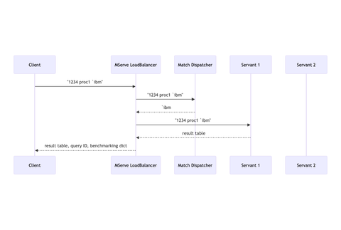

# mserve

A high-performance load balancing solution for KDB+/q applications, based on [mserve\_np](https://github.com/nperrem/mserve) by Nathan Perrem (formerly of First Derivatives) and the original [LoadBalancing](https://code.kx.com/trac/wiki/Cookbook/LoadBalancing) cookbook.

## Key Features

* Support for distributed servants across multiple remote hosts
* Programmable dispatch mechanisms for optimized data locality
* Built-in benchmarking for performance tuning
* Secure query execution
* Flexible plugin architecture

### Example Sequence Diagram.

The diagram below shows the messages exchanged in the demo above



* When you run ``send proc1 `IBM`` in the quickstart demo:
    * The message ``(1234; "proc1 `IBM")`` is sent from the client to mserve\_np, which is the 
      client's way of saying to the load balancer "execute the function 'proc1' with argument `IBM and return the result to me with id 1234".
    * mserve\_np sends the query to an internal function (denoted "match dispatcher"). (To see how to 
      select or develop a different method of dispatch, see "examples/04dispatch/04dispatch.md".)
    * which sends back a "routing string" in this case the first argument to the query: `IBM.   

2. When this message is ready to be sent:
    * The routing string is used to select a servant.
    * Prefer to send a query to a servant whose previous query had the same routing string.
    * If preferred servant is not available choose any free (i.e., not busy) servant.
    * The message ``(1234; "proc1 `IBM)`` is forwarded to the selected servant unchanged.

3. When the servant responds with a result table
    * The message ``(1234; <result table>)`` is sent from the servant to mserve\_np.

4. When mserve\_np receives the result
    * msevere\_np notices that the response includes only the id and result, no extra "info".
    * For that reason it provides a default "info dictionary" that reports: 
       * the routing string used
       * which servant ran the request
       * elapsed time (includes time in queue)
       * execution time (excludes time in queue)
    * If the servant had provided its own info dictionary as the 3rd item in the response  
      mserve_np would return that dictionary, with the routing string added to it.
    * The message ``(1234; <result table>; <info dictionary>)`` is sent back to the client

## MServe Glossary  

**API Version:** A specific version of the service interface that defines:
* Supported functions and their signatures
* Expected arguments and return types
* Behavior guarantees

Servants can support multiple API versions simultaneously by routing requests to different namespaces based on the client's requested version.

**Server Type Name:** An identifier that categorizes servers by their specialized function. For example:

* `HF_RDB`: Servers optimized for recent data (e.g., last 48 hours)
* `HF_HDB`: Servers handling historical data

This allows mserve to intelligently route queries based on criteria like date ranges without requiring client-side changes. The server type enables automatic query routing to the most appropriate server based on the query's characteristics.

**Server Type Version:** A version identifier for server implementations that enables controlled server updates. Common scenarios include:

* Backward-compatible API updates
* Breaking API changes
* Performance improvements and bug fixes
* Infrastructure changes (e.g., EC2 instance type updates)
* Configuration modifications (e.g., memory allocation adjustments)

This versioning enables gradual rollouts and canary deployments of server changes.

When a server administrator deploys a new servant, and wants to do it using canary capability, 
mserver needs a way to know which servant is intended to replace what other servant. 


**Secure Invocation:** A security practice that restricts function execution to a pre-defined set of operations. It:

* Prevents execution of arbitrary expressions
* Mitigates code injection risks
* Validates all function arguments
* Limits operations to documented API calls
* Ensures predictable and safe execution

_key characteristics_

- Reduces the risk of code injection attacks.
- Allows execution of only a pre-defined set of commands.
- Arguments are validated or sanitized before command is executed.

See: [Interprocess Communication 101](https://code.kx.com/q4m3/1_Q_Shock_and_Awe/#119-interprocess-communication-101)  

Also for more details about **Secure Invocation** see: "Understanding secure\_invocation.q" in examples/02quickauth/02quickauth.q.

-----------

**Servant** An instance of your api server managed my mserve. When used by itself "servant" might refer to either
a "servant process" (an running instance of your api), or a "servant host" (the machine an instance of your api is running on).

**Plugin** A program that provides some optional functionality to a "main" program without modifying the main program's source code.
The "main" program may provide code to load the plugins, but which plugins get loaded is determined at launch time,
in our case by an environment variable. The environment variable Q\_PLUGINS lists the plugins for the servant processes,
while the variable MSERVE\_PLUGINS lists the plugins for mserve\_np.q itself.

**Dispatch Algorithm** A mechanism that intelligently assigns queries in order to optimize performance. It is an algorithm that selects servants based on certain criteria. 

- **orig**: From the original. Always select the first not-busy server from the top of the list.
- **even**: Avoids unused or under-utilized servants. Always select the next not-busy server further down the list from last dispatch. 
- **match**: Attempts to improve performance by keeping similar queries on the same servant so that data will be "warm".

The "match" algorithm is the default.
To use a different one, set the environment variable 'MSERVE\_ALGO' when launching mserve.
For example, to run with 5 instances of "servant.q" using the 'even' algorithm you could type:

```
MSERVE_ALGO="even" q mserve-np.q 5 servant.q -p 5000
```

New dispatch algorithms may be added as plugins, see "examples/04dispatch/04dispatch.md."


**Routing String** A string (or symbol) derived from a query expression which is used to help select the best servant 
on which to run that query. Only the "match" dispatch algorithm uses a routing string.

The default routing string is just the first argument to the command. That may be changed by setting the MSERVE_ROUTING 
env variable to "q" function definition which accepts the parsed expression and returns the routing string as a symbol.
You can also override the "getRoutingSymbol" function from a plugin. 

## When Should You Use mserve?


### Current Performance

- **When request spikes cause frequent slowdowns**  
  *Consider option:* Distribute requests across multiple servers using a load balancer to mitigate CPU saturation on any single node.

- **When memory usage on one server causes bottlenecks**  
  *Consider option:* Distribute data and workload across multiple nodes to reduce per-server memory pressure. For example, partitioning time-series data across servers by date ranges.


- **When you think you are in a situation where a single machine can be upgraded but might still struggle under peak load**  
  *Consider option:* A lightweight enhancement like socket sharding on Linux to better utilize multiple CPU cores and reduce queue times.

- **When cache thrashing leads to poor query performance**  
  *Consider option:* Route similar queries to the same servers to maintain data locality and improve cache hit rates. This reduces the frequency of data being loaded into and evicted from memory (cache thrashing).

- **When server tuning becomes overly complex**  
  *Consider option:* Deploy multiple smaller servers with standardized configurations behind a load balancer. This reduces the complexity of tuning individual servers and makes the system more maintainable.

### Scalability and Future-Proofing

- **When anticipating significant growth in traffic or data volume**  
  *Consider option:* Implement horizontal scaling through load balancing, allowing you to add more servers as needed without system redesign.

- **When avoiding disruptive system upgrades**  
  *Consider option:* Instead of major system replacements ("forklift upgrades"), gradually scale by adding mid-range servers behind a load balancer. This approach reduces both cost and risk compared to upgrading a single high-end server.

- **When data access patterns evolve over time**  
  *Consider option:* Configure the load balancer to route queries based on data characteristics (e.g., time ranges, data types). This enables efficient data partitioning and specialized node optimization without client-side changes.

- **When planning for future infrastructure expansion**  
  *Consider option:* Design a hardware-agnostic load balancing layer that can seamlessly integrate new server types (e.g., GPU-enabled nodes, high-memory instances) without requiring system-wide architectural changes.

- **When traffic patterns are highly variable**  
  *Consider option:* Implement auto-scaling to dynamically adjust server capacity based on demand. This optimizes resource usage and costs by running fewer servers during low-traffic periods while maintaining the ability to scale up during peak loads.

### Improved Availability

- **When high availability is critical**  
  *Consider option:* Deploy a redundant, multi-server setup with automatic failover capabilities. This ensures service continuity even if individual servers fail, helping meet strict Service Level Agreements (SLAs).

- **When eliminating single points of failure is essential**  
  *Consider option:* Replicate data and services across multiple servers with distributed traffic handling. This ensures system reliability by allowing the service to continue operating even if individual components fail.

- **When system maintenance must not interrupt service**  
  *Consider option:* Perform rolling updates by temporarily removing servers from the load balancer for maintenance while keeping the service running on remaining servers.

- **When geographic redundancy is required**  
  *Consider option:* Deploy servers across multiple locations with a global load balancer. This provides resilience against site-wide failures and can improve performance through locality.

- **When dealing with intermittent server issues**  
  *Consider option:* Implement automatic health checks to detect and route traffic away from problematic servers, ensuring reliable service despite occasional server or network issues.

### Use of Special Hardware

- **When workloads require specialized hardware acceleration**  
  *Consider option:* Route computation-intensive queries to GPU-equipped servers while handling standard queries on regular nodes, maximizing hardware utilization.

- **When server capabilities vary across the cluster**  
  *Consider option:* Direct memory-intensive or I/O-heavy operations to high-memory or SSD-optimized nodes respectively, ensuring optimal resource utilization.

- **When using specialized hardware accelerators**  
  *Consider option:* Tag and route specific workloads to nodes with FPGA or other hardware accelerators, maximizing the benefit of specialized hardware investments.

- **When managing a heterogeneous infrastructure**  
  *Consider option:* Abstract away infrastructure differences through the load balancer, automatically routing requests to compatible servers based on OS version or architecture.

- **When testing new hardware configurations**  
  *Consider option:* Use the load balancer for canary deployments, gradually shifting a percentage of traffic to new hardware while monitoring performance and stability.

## Performance Comparison

The following benchmarks compare the overhead of different load balancing approaches for KDB+/q applications. The results show that our Load Balancing Technology (LBT) achieves comparable performance to less feature-rich alternatives.

The benchmarks below compare elapsed time overhead (in milliseconds) across different implementations:

* LBT: Current version with enhanced features
* NP: Original mserve_np implementation
* AW: Arthur Whitney's original mserve
* SS: Socket sharding ([documentation](https://code.kx.com/q/wp/socket-sharding/))


| System | Min   | Avg   | Max   | Trials | Description                              |
|---------|-------|-------|-------|---------|------------------------------------------|
| LBT     | 0.990 | 1.256 | 1.425 | 50     | Current version with full feature set    |
| NP      | 1.014 | 1.209 | 1.316 | 50     | Original mserve_np implementation        |
| AW      | 0.696 | 0.870 | 0.940 | 50     | Original mserve implementation           |
| SS      | 0.339 | 0.490 | 0.547 | 50     | Socket sharding (baseline)               |

### Benchmark Methodology

* Test scenario: Round-trip timing of an "echo" query (returns its single argument)
* Environment: All tests use servant.q from examples with added echo function
* Exception: NP version uses its own servant due to different function evaluation approach
* Security note: NP's approach of sending functions for evaluation is not compatible with secure invocation

### Historical Performance Data

Previous benchmarks comparing different load balancing approaches (times in milliseconds):

| System | Avg   | Max   | Min | Performance Characteristics           |
|--------|-------|-------|-----|---------------------------------------|
| LBT    | 0.411 | 0.515 | N/A | 93% of queries under 0.5ms           |
| NP     | 0.367 | 1.000 | N/A | 63% of queries with sub-ms latency   |
| AW     | 0.696 | 0.921 | N/A | All queries exceeded 0.5ms           |

Additional implementations pending evaluation:
* Socket sharding (SS)
* Direct connection (no load balancer)
* Nginx TCP load balancer

### Measurement Methodology

**Timing Implementation:**
* LBT/NP: Uses internal queries table with timestamps
  - LBT: Nanosecond precision (timestamp datatype)
  - NP: Millisecond precision (time datatype)
* AW: Client-side timing using echo command timestamps

**References:**
* [Socket Sharding Documentation](https://code.kx.com/q/wp/socket-sharding/)
* [Nginx Load Balancing Guide](https://iceburn.medium.com/nginx-tcp-load-balancing-6f9509b772f2)
