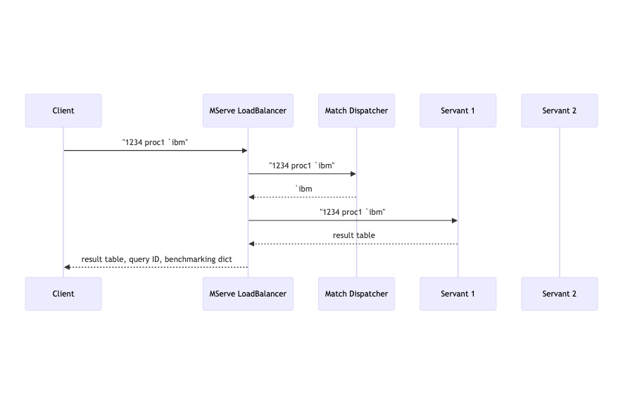

# mserve
Enhanced mserve load balanced solution

## Starting the Server

From the root of the repo:
```
q mserve.np.q [number of servants] [servant file to load]  [host1]  [host2] ...  -p [port number]
```

Here each "host" is an ip address or resolvable host name for each machine
available for running servants.

When no "hosts" are specified, All servants will be started on the local machine.
To include the local machine in the list of hosts, specify "localhost".

When a list of hosts is specified, servants will be started on them in a round robbin. 
When the number of servants equals the number of host names, one servant is started on each host.

## Quickstart Demo

We will run a demo with two servants each of its hosts.

**Step 1 - Prepare the hosts**

You will need 3 machines that are accessible to each other over the network;
2 as servants and one for mserve\_np.q.

The way I did it, was with 3 AWS EC2 instances, running "mserve\_np.q" on the
instance hosting my development environment, which I will call the "mserve" machine, 
and 2 instances of a more stripped down instances of a stripped down (but powerfull)
"servant" machine.

1. Ensure that the "mserve machine" can reach the 2 servants on ports 5999 and 5001.
2. Run 'q launcher.q -p 5999' from the mserve directory on each servant.

Launcher.q listens for requests to start servant processes as directed by mserve\_np.q.

If this was a "real" deployment, "servant.q" would be replaced by your real api server,
and all the data it needs must be accessable from each of these AWS instances.

Alternatively, you could build this structure into a docker container and run in a container service.

**Step 2 - Start the server in a terminal on the mserve machine**

Assuming the IP addresses of the servant AWS instances are 172.30.0.20 and 172.30.0.207

```
q mserve_np.q 2 servant.q 172.30.0.20 172.30.0.207 -p 5000
```

This runs mserve\_np.q on the mserve machine, listening on port 5000,
with one instance of servant.q running as 172.30.0.20:5001 and another as 172.30.0.207:5001
  
If the number of servants was greater than the number of IP addresses, additional servant processes
would be started using successive port numbers on those hosts with more than one servant process.

For example, if the number of servants was 3, you would get servant processes running as:
172.30.0.20:5001, 172.30.0.20:5002, and 172.30.0.207:5001

  
**Step 3 - Start the demo client in another terminal on the mserve machine**

```
q qs.q 5000   /give it the port number that mserve\_np.q is listening on.
```

**Step 4 - Try a test query** 

```
send "proc1 `IBM"
```

This sends a message like (1234;  "proc1 `IBM)" to mserve_np.q as a general list. 
Here 1234 is an integer generated by the client, which will be echoed back, to allow matching the 
response with its request. This message is displayed on the client console.

**Step 5 - Await the response** 

If all goes, Console Output should look like the below, with an echoed value, and a return value with an ID, a dictionary 
and the actual computed result, in this case, a result table:

```
q)send "proc1 `IBM"
(1234;"proc1 `IBM")

ID: 1234
--info--
qsvr     | `:172.30.0.207:5001
elapsed  | 5892
execution| 5892
route    | `IBM
--result--
SYM MAX      MIN          OPEN    CLOSE    AVG      VWAP     DEV      VAR     
------------------------------------------------------------------------------
IBM 99.99956 5.739275e-05 1.89879 58.87289 50.04816 50.04443 28.84313 831.9261
```

### Understanding the Console Output
  
1. The line directly under the request ``(1234; "proc1 `IBM")`` is the "q" data structure 
   that is actually sent from the  client to mserve and forwarded to the servant.
2. There are 3 parts to the response, the id echoed from the client, the query result,
   and a dictionary containing benchmarking information.
3. That information includes which servant the query ran on, the elapsed time of the query,
   The execution time (excludes time in queue), and the "routing string" used to help select the servant.

### Understanding the demo client (qs.q)

The demo client is a stand-in for a real client application.
It assumes that mserve\_np.q is running on the same machine as itself, gets its port number 
from a command line argument, and opens a handle to it upon startup.

The demo client provides only one global function "send", whose argument is the query to send.
It increments a query sequence number "qid" and sends the list ``(qid; query)`` over the open handle.

The demo client also provides a [.z.ps](https://code.kx.com/q/ref/dotz/#zps-set) handler to display the responses.
Each response is expected to consist of 3 parts ``(qid; result; info)`` which are displayed separately.
Although the "info" comes after the "result" in the response, it is displayed first.

Finally the demo client provides a [.z.ts](https://code.kx.com/q/ref/dotz/#zts-timer) handler to send a series of "proc1" requests 
for random symbols on the timer.

### Understanding the demo server (servant.q)

The demo server is a stand-in for a real api server. It has just 2 endpoints, "proc1" and "proc2". 

They both calculate the aggregates shown in the above result, for a given symbol in the dummy
trade table created at the top of the file.

However proc2 was made more expensive than proc1 by executing the query for more repetitions.

Additional code was needed to support "Secure Invocation" which means preventing the execution
of arbitrary code on the servants, essentially by "avoiding use of eval".

To do that we override .z.pg to  prevent synchronous queries entirely.
We override [.z.ps](https://code.kx.com/q/ref/dotz/#zps-set) (for async) to allow execution only of the global functions "proc1" and "proc2",
with no recursive evaluation in their arguments.

1. If we get a string, we parse it.
2. We expect the first item in the (parsed) command list to be a symbol: `proc1 or `proc2.
3. If we get anything else, we send back an "Unknown Command" error.
4. Otherwise we invoke the named function explicitly on the argument in the second item of 
   the command list, and send back the result or trapped error.
5. The "send" function used here handles the special case where the request is received on handle zero,
  by simply displaying the response, rather than trying to send it. This allows you to run the servant
  independent of mserve, and test your api (and [.z.ps](https://code.kx.com/q/ref/dotz/#zps-set) handler) from there servant console itself, where
  you can get breakpoints, etc.

Unfortunately, "Secure Invocation" prevents mserve from setting the .z.pc handler to cause
the servant to terminate upon disconnect. So we need to hard-code this into servant.q itself.

There were two problems with that.
1. The .z.pc handler seems to get called immediately after start up, before any connection is made.
2. If the server is running independent of mserve, clients will come and go, but it should stay up
 until explicitly shut down.

These problems were solved by adding 2 status flags.
1. **isopen** is set in .z.po when a connection is made, and checked in .z.pc before terminating.
2. **autoclose** termination is disabled unless autoclose is set. It is currently set by default, 
  because we are always running under mserve, however it could be set only when, say, an environment 
  variable "MSERVE_AUTOCLOSE=1" indicates it is running under mserve. 

### What is a routing string ?

In our benchmarking experiments we are trying to determine the best way to farm out queries to a collection of servers. 
So far, we have tried 3 methods, called "dispatch algorithms", and do not have firm conclusions yet.

Originally meserve\_np just sent each query to the first servant from the top the the list which was not busy.
This tended to put too many queries on the same servant, and could leave others completely unused.

So we tried sending each query to next free servant down the list from the last dispatched servant.
This distributed the queries evenly, but that actually was slower because more queries ran on newly
started servers, and so had a cold cache.

The method we are using now, computes a "routing string" from the query as a hint as to what part of the database
the query accesses, so that when a query runs on a server who's previous query and the same routing string,
the data is more likely to still be in cache.

We currently use the first argument to the query as the routing string.
That was really designed for an experiment which runs against a large date-partitioned historical database
and the first argument is a date or date range.

### Example Sequence Diagram

The diagram below shows the messages exchanged in the demo above



* When you run ``send proc1 `IBM`` in the quickstart demo:
    * The message ``(1234; "proc1 `IBM")`` is sent from the client to mserve\_np.
    * mserve\_np sends the query to an internal function (denoted "match dispatcher")
    * which sends back a "routing string" in this case the first argument to the query: `IBM.   

2. When this message is ready to be sent:
    * The routing string is used to select a servant.
    * Prefer to send a query to a servant whose previous query had the same routing string.
    * If preferred servant is not available choose any free (ie not busy) servant.
    * The message ``(1234; "proc1 `IBM)`` is forwarded to the selected servant unchanged.

3. When the servant responds with a result table
    * The message ``(1234; <result table>)`` is sent from the servant to mserve\_np.

4. When mserve\_np receives the result
    * msevere\_np notices that the response includes only the id and result, no extra "info".
    * For that reason it provides a default "info dictionary" that reports: 
       * the routing string used
       * which servant ran the request
       * elapsed time (includes time in queue)
       * execution time (excludes time in queue)
    * If the servant had provided its own info dictionary as the 3rd item in the response  
      mserve_np would return that dictionary, with the routing string added to it.
    * The message ``(1234; <result table>; <info dictionary>)`` is sent back to the client

## Requests and Responses

1. A **request** is a general list where the first element is an integer id 
 intended to be echoed back with the response, and the second element 
 is the query or command either as as string or general list.
 Additional items may be present in this list, and will be included in the message sent
 to the servant. Such items may be used in any way agreed to between client and servant.
 *(id, query, option1, option2...)*


2. A **response** is a general list where the first element is an integer id
 echoed back from the request, and the second element is the result computed by the servant. 
 Additional items may be present in this list and will be included in the the message sent
 back to the client. Such items may be used in any way agreed to between client and servant.
 *(id, result, info1, info2...)*

3. When no "info" is included with the response from the servant, mserve_np.q will add its own
   **default info dictionary** which is what you see labeled "--info--" in the example output above.
   It tells you which servant your query ran on, how long it took, and the "routing string" computed
   by mserve_np.q to help choose the server to run on.

4. Because the routing string is computed by mserve_np.q rather than being sent from the client or servant,
   there is no pre-defined place to put it when "info" is being passed back from the servant. For now, the 
   routing string will be set in the 3rd item sent back from the servant, provided it is a dictionary (like the default).
   Otherwise the routing string is not reported.

5. Some of the uses envisioned for the extra "options" and "info" are:
  authorization, accounting, benchmarking, error status, and debugging.

## Secure Invocation

 We assume that our "servant" may be running an application which may need to accept 
 untrusted input, and want to prevent requests from running arbitrary code upon it.

 We accomplish that by restricting queries to invoking functions defined in global
 variables on the servant, with no recursive evaluation in their parameters.

 This is enforced in the [.z.ps](https://code.kx.com/q/ref/dotz/#zps-set) handler of servant.q

```
.z.ps:{
  ex:$[10=type x 1; parse x 1; x 1] ;
  fn:$[`proc1=ex 0; proc1; `proc2=ex 0; proc2; (::)] ;
  if[fn~(::); send[.z.w;] (x 0; 0N!"Error: unknown command: ", string ex 0)];
  send[.z.w] (x 0; @[fn; ex 1; {[e] 0N!"Error: ",(string ex 0), " ", e}]);
 };
send:{[h;data] if[h=0; -1 "\nresult:"; :show each data]; (neg h) data} ;
```

1. If we get a string we parse it; we leave general lists alone.
2. If our expression invokes a global function, the first position of the parsed
   command contains the function name as a symbol. We check that the function
   name is one of the two we provide: either `proc1 or `proc2.
3. If we get something else we send back an "unknown command" error.
4. In this case, both proc1 and proc2 take only a single argument,
   which will appear as the second item in the parsed command.
   We invoke the function on that item without using "eval" or "value",
   which could run injected code.
5. The "send" function above allows testing from the servant console by sending
   the request to handle zero.

## Real World Secure Invocation
 
In a real application the servant would have more than 2 api endpoints, and users
may need various roles or permissions to access them. These might also require 
validation of the arguments. 

Moreover the client would also need to implement secure invocation when receiving responses.

In addition on both the client and servant, there may be other traffic that the .z.ps handler
must direct besides these queries and responses.

### validating endpoints


### validating arguments


### accommodating other traffic


 
--------------------------------
previous content below this point

## Quickstart Demo on Linux

1. Open two terminal windows
2. In first window invoke: q mserve\_np.q 2 servant.q -p 5000
3. In second window invoke: q client.q -master 5000
4. Upon startup, client should send one query to myserve\_np.q which will forward it to a servant. 
5. It will take several seconds to get the first result, which will show some benchmarking info
   directly above the actual result.
6. Will also store all results in an internal table calld "results"
7. Once you get first result you can start the timer to run a series of them.


## Details

Nathan Perrem
First Derivatives
2013-05.22

This is a heavily modified version of Arthur Whitney's mserve solution which can be found at code.kx:
https://code.kx.com/trac/wiki/Cookbook/LoadBalancing

The purpose of mserve is to provide load balancing capabilities so that queries from one or more client
can be sent to the master who will then distribute these queries to the servants in a efficient load balanced way.
The servants will then send the results back to the master who sends the results back to the client.

The main enhancements in this version are:
  Master retains details of client queries in an internal table called queries. queries table keeps track on status/location
  of all queries.
  Master sends query (FIFO) to a servant only when that servant is available.
  Dropped connections to client or servant are now handled.
  Client sends master message as a pair - (query,callback).
    where callback is the name or definition of the client's delegated callback function. This callback will handle the returned result.

On Windows, to kick off the master, 4 servants and 4 clients, simply run the included .bat file.
On Linux, create an appropriate .sh file from the .bat file or kick off processes in separate shells.
