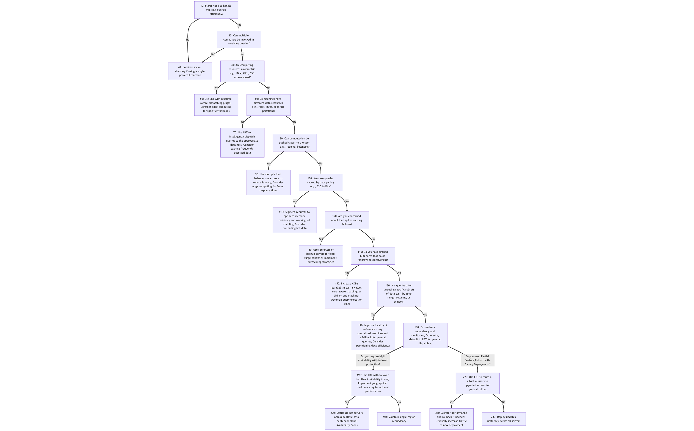

# mserve
Enhanced mserve load balanced solution

Enhanced mserve load balanced solution based on [mserve\_np](https://github.com/nperrem/mserve) which was based on [LoadBalancing](https://code.kx.com/trac/wiki/Cookbook/LoadBalancing) adding "servants" on multiple remote hosts, and providing for query locality. Also designed to provide benchmarking information.

### Example Sequence Diagram

The diagram below shows the messages exchanged in the demo above


* When you run ``send proc1 `IBM`` in the quickstart demo:
    * The message ``(1234; "proc1 `IBM")`` is sent from the client to mserve\_np, which is the 
      client's way of saying to the load balancer "execute the function 'proc1' with argument `IBM and return the result to me with id 1234".
    * mserve\_np sends the query to an internal function (denoted "match dispatcher"). (To see how to 
      select or develop a different method of dispatch, see "examples/04dispatch/04dispatch.md".)
    * which sends back a "routing string" in this case the first argument to the query: `IBM.   

2. When this message is ready to be sent:
    * The routing string is used to select a servant.
    * Prefer to send a query to a servant whose previous query had the same routing string.
    * If preferred servant is not available choose any free (i.e., not busy) servant.
    * The message ``(1234; "proc1 `IBM)`` is forwarded to the selected servant unchanged.

3. When the servant responds with a result table
    * The message ``(1234; <result table>)`` is sent from the servant to mserve\_np.

4. When mserve\_np receives the result
    * msevere\_np notices that the response includes only the id and result, no extra "info".
    * For that reason it provides a default "info dictionary" that reports: 
       * the routing string used
       * which servant ran the request
       * elapsed time (includes time in queue)
       * execution time (excludes time in queue)
    * If the servant had provided its own info dictionary as the 3rd item in the response  
      mserve_np would return that dictionary, with the routing string added to it.
    * The message ``(1234; <result table>; <info dictionary>)`` is sent back to the client

## MServe Glossary  

**Secure Invocation:** The practice of executing q functions or operations in a controlled manner, 
without evaluating arbitrary expressions. This mitigates security risks associated with executing 
client-provided strings, which might contain malicous code. Instead, Secure Invocation only allows 
execution of a limited number pre-defined functions, as in a conventional API call. In addition,
Secure invocation must prevent execution of arbitary expressions which might appear in the
arguments to the functions.

_key characteristics_
- Reduces the risk of code injection attacks.
- Allows execution of only a pre-defined set of commands.
- Arguments are validated or sanitized before command is executed.

See: [Interprocess Communication 101](https://code.kx.com/q4m3/1_Q_Shock_and_Awe/#119-interprocess-communication-101)  

Also for more details about **Secure Invocation** see: "Understanding secure\_invocation.q" in examples/02quickauth/02quickauth.q.

**Servant** An instance of your api server managed my mserve. When used by itself "servant" might refer to either
a "servant process" (an running instance of your api), or a "servant host" (the machine an instance of your api is running on).

**Plugin** A program that provides some optional functionality to a "main" program without modifying the main program's source code.
The "main" program may provide code to load the plugins, but which plugins get loaded is determined at launch time,
in our case by an environment variable. The environment variable Q\_PLUGINS lists the plugins for the servant processes,
while the variable MSERVE\_PLUGINS lists the plugins for mserve\_np.q itself.
 
**Dispatch Algorithm** A means of selecting a servant to run a particular query. In mserve\_np.q, a dispatch algorithm
is selected by copying it to the global variable "check". Currently, there are 3 dispatch algorithms available:
- **orig**: From the original. Always select the first not-busy server from the top of the list.
- **even**: Avoids unused or under-utilized servants. Always select the next not-busy server further down the list from last dispatch. 
- **match**: Attempts to improve performance by keeping similar queries on the same servant so that data will be "warm".

The "match" algorithm is the default.
To use a different one, set the environment variable 'MSERVE\_ALGO' when launching mserve.
For example, to run with 5 instances of "servant.q" using the 'even' algorithm you could type:

```
MSERVE_ALGO="even" q mserve-np.q 5 servant.q -p 5000
```

New dispatch algorithms may be added as plugins, see "examples/04dispatch/04dispatch.md."
   
**Routing String** A string (or symbol) derived from a query expression which is used to help select the best servant 
on which to run that query. Only the "match" dispatch algorithm uses a routing string.

The default routing string is just the first argument to the command. That may be changed by setting the MSERVE_ROUTING 
env variable to "q" function definition which accepts the parsed expression and returns the routing string as a symbol.
You can also override the "getRoutingSymbol" function from a plugin. 



## Understanding the Load Balancing Decision Tree

### 1. Handling Multiple Queries (10-30)
The first decision is whether multiple queries need to be handled efficiently. If not, socket sharding (20) on a single machine may be sufficient. Otherwise, multiple computers should be considered (30).

### 2. Asymmetric Resources (40-50)
If the system has asymmetric computing resources, such as machines with varying RAM, GPUs, or SSD access speeds, LBT with a resource-aware dispatching plugin (50) is recommended. If resources are uniform, data distribution is the next consideration (60).

### 3. Data Location Optimization (60-70)
When different machines hold distinct data resources, such as separate historical and real-time data repositories, LBT should be used to direct queries to the appropriate host (70). If all machines access the same data, the system should be examined for regional balancing opportunities (80).

### 4. Geographic Optimization (80-90)
If reducing latency for users in different locations is a priority, multiple load balancers should be deployed near users (90). Otherwise, focus shifts to handling slow query performance caused by data paging (100).

### 5. Managing Memory & Paging (100-110)
For systems experiencing slowdowns due to data paging, segmenting requests and optimizing memory residency (110) can improve performance. If paging is not an issue, the next concern is handling potential load spikes (120).

### 6. Handling Spikes (120-130)
To manage unpredictable usage spikes, serverless computing or backup servers should be used for load surge handling (130). If spikes are not a major concern, the system's CPU utilization is assessed (140).

### 7. CPU Utilization (140-150)
When CPU cores are underutilized, increasing KDB’s parallelism or using LBT within a single machine (150) can enhance performance. If CPU efficiency is already optimal, the focus shifts to query patterns and data subsets (160).

### 8. Locality of Reference (160-170)
If queries frequently target specific subsets of data, specialized machines should be used with a fallback for general queries (170). Otherwise, general redundancy and monitoring should be ensured (180).

### 9. High Availability (180-200)
For systems requiring high availability, failover to other Availability Zones should be implemented with geographical load balancing (190). If redundancy is not a priority, a single-region setup may suffice (210).

### 10. Canary Deployments (220-230)
For controlled feature rollouts, LBT can route a subset of users to upgraded servers for gradual rollout (220). Performance monitoring and rollback mechanisms (230) should be in place before full deployment.

## Load Balancing for a Hedge Fund Trading System Example  

A hedge fund operating a high-frequency trading (HFT) system needs to ensure ultra-low latency execution while handling massive data volumes from multiple exchanges. The architecture choices in this decision tree guide the firm through setting up an optimized and resilient trading infrastructure.

### 1. Handling Multiple Queries (10-30)
The hedge fund must process thousands of trades per second while running analytics on historical data. Since a single machine cannot handle this efficiently, step **30** leads to deploying multiple computers.

### 2. Asymmetric Resources (40-50)
The fund's risk management system runs on GPU-accelerated servers, while order execution uses CPU-optimized machines. Step **50** recommends using LBT with a dispatching plugin to allocate workloads accordingly.

### 3. Data Location Optimization (60-70)
Live trading data is stored in RDBs, while historical analytics use HDBs. Following step **70**, LBT routes historical queries to the correct HDB partitions, minimizing data movement and improving response times.

### 4. Geographic Optimization (80-90)
Traders in New York, London, and Hong Kong require the lowest latency possible. Step **90** suggests using multiple load balancers close to each location to minimize network delays.

### 5. Managing Memory & Paging (100-110)
Simulations on years of tick data can overwhelm RAM, causing performance drops. Step **110** recommends segmenting requests to keep active datasets in memory and preloading frequently accessed data.

### 6. Handling Spikes (120-130)
Market events like Fed announcements lead to huge spikes in trading activity. Step **130** ensures that serverless resources and autoscaling clusters back up the main trading system during peak loads.

### 7. CPU Utilization (140-150)
Not all cores are utilized during off-peak hours. Step **150** improves efficiency by increasing KDB’s parallelism and using core-aware query scheduling.

### 8. Locality of Reference (160-170)
Traders often request data from specific time ranges or securities. Step **170** optimizes queries by directing them to specialized machines while ensuring a fallback option for uncategorized requests.

### 9. High Availability (180-200)
To prevent downtime, Step **190** introduces LBT’s failover feature, allowing failover across multiple AWS Availability Zones. Step **200** distributes hot servers across multiple data centers to ensure redundancy.

### 10. Canary Deployments (220-230)
The fund is rolling out an AI-based execution algorithm but wants to test it on a small subset of trades before full deployment. Step **230** enables controlled rollout via LBT, gradually increasing traffic while monitoring performance.

By following this structured approach, the hedge fund ensures a **highly optimized, scalable, and fault-tolerant trading infrastructure** that meets the needs of modern electronic trading.


